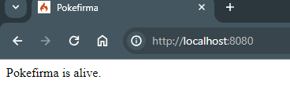

# pokefirma
Prueba tecnica para postular a desarrollador fullstack en firmavirtual.legal

<section>
Desarrollador: <b>Andres Villarroel</b>

</section>

# Client Side
React Framework

# Server Side
PHP Codeigniter 4.5 [https://codeigniter.com] 

### Requisitos para levantar la api:
- PHP `>= 8.1`
  - Extensiones `intl`, `mbstring`, `mysqli`, `curl`
- Apache o Nginx
- Mysql `>= 5.7`

### Pasos para levantar la api
1) Levantar el servicio de mysql.
2) en la base de datos es necesario crear la base de datos en este caso la llamaremos `pokefirma`. | SQL `CREATE DATABASE pokefirma`.
3) renombrar el archivo env a .env y cambiar las credenciales de la base de datos.
4) ejecutar las migraciones en la terminal `php spark migrate:refresh`.
5) levantar el servidor en la terminal `php spark serve`.
6) ir a http://localhost:8080/ ,  en caso de que salga otro puerto cambiarlo en la url

